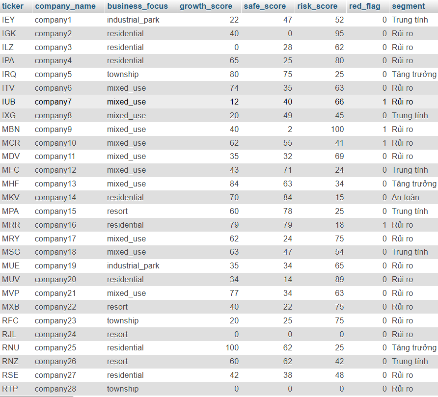

# Stock Scoring Model using Financial & Market Data

## Overview
This project builds a simple scoring model to classify companies into 
**Growth, Safe, Neutral, and Risk** groups using financial and market data.

The goal is to turn complex stock data into a clear and easy-to-understand result.

---

## Dataset Disclaimer
⚠️ This project uses **simulated data** for learning purposes.  
It is **not used for real investment decisions**.

---

## Business Problem
Stock data can be hard to understand, especially for beginners.

This project helps:
- simplify financial data  
- turn raw data into scores  
- group companies into clear categories  

---

## Data Sources
The dataset includes 3 tables:

- **company_master**  
  Basic company information (sector, market cap, years listed, equity)

- **daily_market_data**  
  Price, returns, liquidity, and market activity

- **monthly_fundamentals**  
  Financial metrics like ROE, income, debt ratio, and cash flow

---

## Methodology

1. Get the latest daily and monthly data  
2. Calculate 20-day metrics  
3. Join all tables into one dataset  
4. Use `PERCENT_RANK()` to create scores  
5. Calculate:
   - Growth score  
   - Safe score  
   - Risk score  
6. Use rules to classify companies  

---

## Scoring Logic

### Growth Score
- ROE  
- Net income  
- Backlog & pre-sales  
- Price performance  

### Safe Score
- Debt ratio  
- Liquidity ratios  
- Cash flow  

### Risk Score
- High debt  
- Low liquidity  
- High volatility  
- Risk flags  

---

## Key Insights

- High growth often comes with higher risk  
- Risk flags can strongly affect the final result  
- Some metrics like backlog and pre-sales have a big impact on growth score  
- Only a few companies are classified as "safe"  

---

## Output Example

---

## Limitations
- Data is simulated  
- Scoring weights are set manually  
- Results do not reflect real market conditions  

---

## Future Improvements
- Use real financial data  
- Improve scoring logic  
- Build a dashboard (Power BI)
